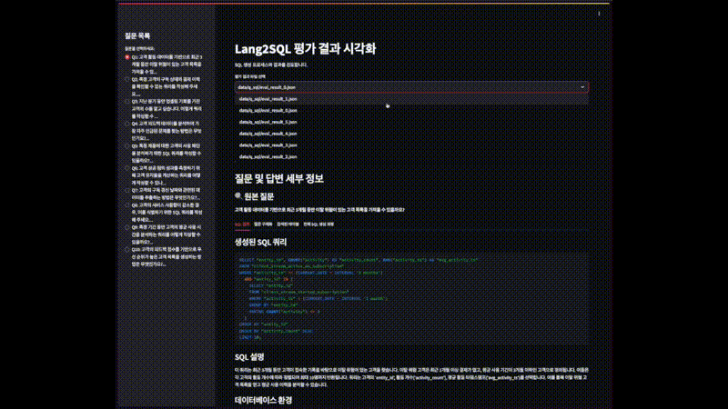

# Lang2SQL 평가 데이터셋 생성 도구

이 프로젝트는 Text-to-SQL 모델의 평가를 위한 데이터셋을 생성하고 결과를 시각화하는 도구입니다.



## 프로젝트 구조
```
lang2sql-eval/
├── app/
│   └── viz_eval.py           # Streamlit 기반 평가 결과 시각화 도구
├── src/
│   ├── datahub_cls/         # Datahub 메타데이터 관련 클래스
│   ├── persona_class.py     # 페르소나 클래스 정의
│   ├── gen_persona.py       # 페르소나 생성 스크립트
│   ├── gen_question.py      # 질문 생성 스크립트
│   ├── gen_answer.py        # SQL 답변 생성 스크립트
│   └── utils.py             # 유틸리티 함수
├── data/
│   ├── persona/             # 생성된 페르소나 데이터
│   ├── questions/           # 생성된 질문 데이터
│   └── q_sql/              # 생성된 SQL 답변 데이터
└── .env                     # 환경 변수 설정
```

## 설치 및 설정

0. .env 파일 생성
```bash
cp .env.sample .env
# .env 파일을 열어 필요한 설정 입력
# DATAHUB_SERVER, OPENAI_API_KEY 설정
```

1. 가상환경 생성 및 활성화
```bash
python -m venv .venv
source .venv/bin/activate  # Windows: .venv\Scripts\activate
```

2. 필요한 패키지 설치
```bash
pip install -r requirements.txt
```

3. 환경 변수 설정
```bash
cp .env.sample .env
# .env 파일을 열어 필요한 설정 입력
```

## 평가 데이터셋 생성 절차

1. 페르소나 생성
```bash
python src/gen_persona.py
```
- Datahub 서버에서 테이블 메타데이터를 가져와 페르소나를 생성
- 생성된 페르소나는 `data/persona/personas.json`에 저장

2. 질문 생성
```bash
python src/gen_question.py
```
- 생성된 페르소나를 기반으로 질문 생성
- 생성된 질문은 `data/questions/` 디렉토리에 저장

3. SQL 답변 생성
```bash
python src/gen_answer.py
```
- **주의**: 이 단계는 별도의 langgraph 모델이 필요합니다
- langgraph 모델을 로드한 후 실행해야 합니다
- 생성된 답변은 `data/q_sql/` 디렉토리에 저장

4. 결과 시각화
```bash
streamlit run app/viz_eval.py
```
- 생성된 평가 데이터셋을 웹 인터페이스에서 확인 가능

## Langgraph 모델 설정

`gen_answer.py` 실행을 위해서는 별도의 langgraph 모델이 필요합니다:

```python
# src/gen_answer.py에서
if __name__ == "__main__":
    graph = load_graph()  # langgraph 모델 로드
    get_eval_result(graph)
```
